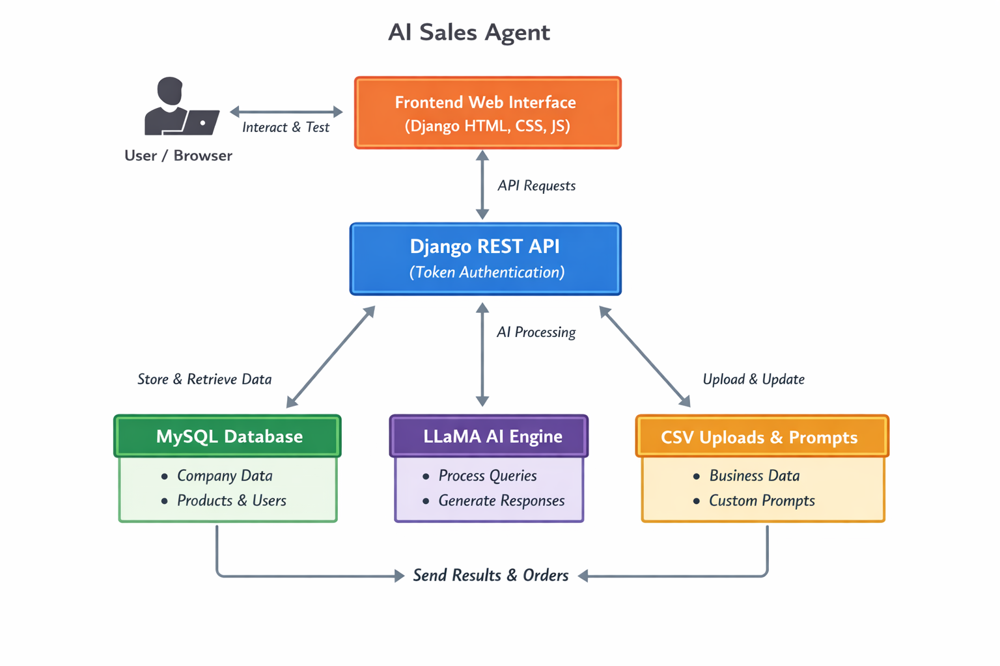
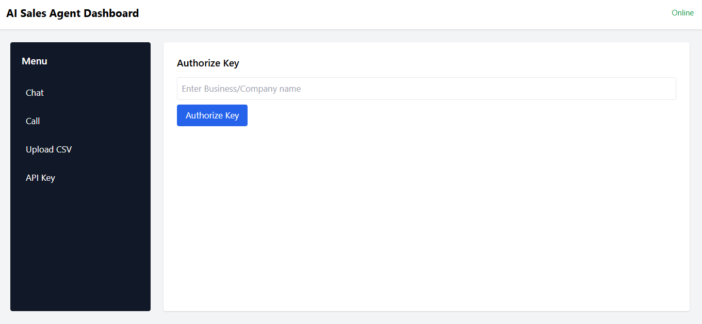
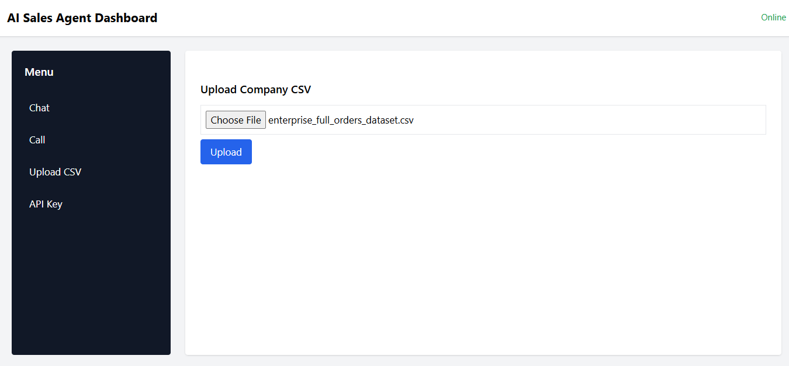
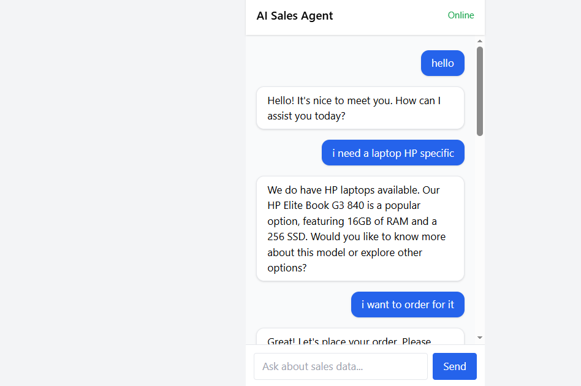
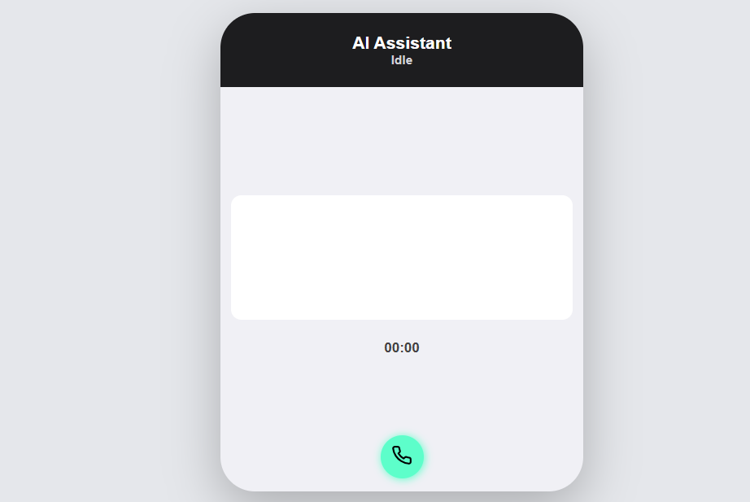

## 🛠 Tech Stack

Backend:
- Python
- Django
- Django REST Framework
- REST API Design
- Token Authentication

Database:
- MySQL

AI:
- LLaMA Language Model
- Prompt Engineering
- Contextual Retrieval

Frontend:
- Django Templates
- HTML
- CSS
- JavaScript

CI/CD: GitHub Actions
OS Tested On: Linux (Ubuntu recommended)

---


# AI Sales Agent  Multi-Tenant Conversational Commerce Platform

An AI-powered sales assistant that enables businesses to upload their company data and interact with customers through intelligent, context-aware conversations.

This platform transforms structured product datasets into a conversational commerce engine powered by LLaMA.

---

## 🚀 Live Demo

Test the system here:

👉 https://nexai.nexapytechnologies.com/api/test

Generate an API key, upload a company dataset, and interact with the AI sales assistant in real time.

---

## 🎥 Demo Video

Watch a short walkthrough of the system in action:

[Watch Demo Video](https://github.com/nexapytech/ai-sales-agent/releases/download/v1.0/ai_sales_chat.mp4)
- API key generation  
- CSV upload  
- Conversational AI responses   
- Order creation workflow  

---

## 🧩 Problem

Many businesses have structured product data but lack an intelligent interface that allows customers to interact with that data conversationally.

Traditional e-commerce systems rely on filters and keyword search. This project introduces conversational commerce powered by AI.

---

## 💡 Solution

AI Sales Agent enables:

- Multi-tenant company onboarding  
- Secure API-based authentication  
- Company-specific dataset ingestion  
- Prompt customization per business  
- AI-driven conversational responses  
- Order placement via API  

Each company operates within its own isolated dataset and prompt configuration.

---

## 🚀 Features

- Multi-tenant architecture (company-level data isolation)
- Token-based API key authentication
- CSV product data ingestion
- Company-specific AI prompt customization
- LLaMA-powered contextual responses
- MySQL-backed persistent storage
- RESTful API endpoints
- Order creation system
- Django-based frontend testing interface
- Secure token validation for protected endpoints

---

## 🔐 Authentication

The system uses token-based authentication.

Each business generates an API key before interacting with protected endpoints.

### Generate API Key

```bash

POST /api/generate-key/

Request Body:

{
  "username": "company_name"
}
````

```bash
Response:

{
  "api_key": "abc123xyz456..."
}
```
All protected endpoints require:

Authorization: Token <api_key>

---

## 📡 API Overview

### Upload Company Data

POST /api/upload/

Form Data:
file: products.csv

---
```bash
### Chat with AI

POST /api/chat/

Request:

{
  "message": "Do you have laptops under $1000?"
}

Response:

{
  "answer": "Yes, Dell XPS 13 is available for $900."
}
```
---


## 🏗 System Architecture



### Architecture Components

Frontend:
- Django Templates
- HTML
- CSS
- JavaScript

Backend API:
- Django
- Django REST Framework
- Token Authentication
- RESTful API Design

Database:
- MySQL

AI Engine:
- LLaMA Language Model
- Dataset-aware response generation
- Company-level prompt control

---


## 🔄 How It Works

1. A company generates an API key.
2. The company uploads its product dataset via CSV.
3. The dataset is stored in MySQL.
4. The company configures its AI response prompt.
5. Customers interact with the AI sales assistant.
6. The AI generates contextual responses using LLaMA.
7. Orders are created through authenticated API endpoints.

---

## 🖥 Demo Screenshots

### Home page


### Upload CSV


### Chat Interface


### Call Placement


---

## 🌐 Frontend Testing Interface

The Django-based frontend is available here:

👉 https://nexai.nexapytechnologies.com/api/test

This interface allows:

- API key generation  
- Dataset upload  
- Conversational testing  
- Order creation  

---

## 🔐 Security & Design Considerations

- Token-based authentication
- Company-level dataset isolation
- Input validation on CSV ingestion
- Controlled AI prompt updates
- Backend-protected endpoints
- Scalable REST API structure

---

## 📩 Source Code Access

The core implementation is currently private while the platform continues to evolve.

If you are a recruiter, engineering team, or company interested in reviewing the implementation or discussing the architecture, please contact me.

📧 samsontobi360@gmail.com  
📍 Lagos, Nigeria  

---

## 🚀 Future Enhancements

- Usage analytics dashboard
- Vector database integration
- AI payment integration
